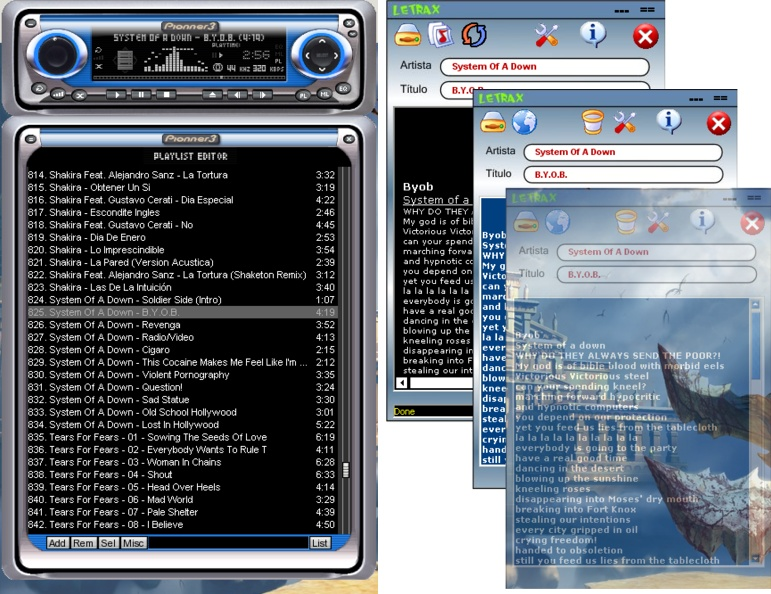



## Letrax Updated Fixed\!

### Description

This program looks for lyrics of the songs that are executed in winamp. It allows to keep lyrics in ordered folders. Tag of the songs is necessary. I hope that he is to them useful!. Super_button in rar File.
 
### More Info
 

             |
---                |---
**Submitted On**   |2009-10-01 17:42:22
**By**             |[Roy Sanchez B](https://github.com/Planet-Source-Code/PSCIndex/blob/master/ByAuthor/roy-sanchez-b.md)
**Level**          |Intermediate
**User Rating**    |5.0 (10 globes from 2 users)
**Compatibility**  |VB 6\.0
**Category**       |[Sound/MP3](https://github.com/Planet-Source-Code/PSCIndex/blob/master/ByCategory/sound-mp3__1-45.md)
**World**          |[Visual Basic](https://github.com/Planet-Source-Code/PSCIndex/blob/master/ByWorld/visual-basic.md)
**Archive File**   |[Letrax\_Upd2164091012009\.zip](https://github.com/Planet-Source-Code/roy-sanchez-b-letrax-updated-fixed__1-63043/archive/master.zip)

